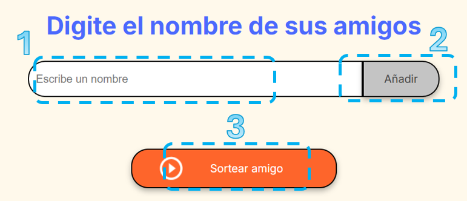

# PROYECTO AMIGO SECRETO 🦹🎉

### !Sean Bienvenidos al Proyecto Amigo Secreto!🪄🎲

## INDICE

- [DESCRIPCION DEL PROYECTO](#descripcion-del-proyecto-)
- [INSTRUCCIONES DE USO](#instrucciones-de-uso-)
- [FUNCIONALIDADES](#funcionalidades-)
- [ESTADO DEL PROYECTO](#estado-del-proyecto-)
- [TECNOLOGIAS UTILIZADAS](#tecnologias-utilizadas-)
- [ACCESO AL PROYECTO](#acceso-al-proyecto-)
- [AUTOR](#autor-)

## DESCRIPCION DEL PROYECTO ✨

El proyecto amigo secreto consta de una pagina web en donde puedes agregar una lista de amigos y asi elegir a uno de ellos de forma aleatoria.

## INSTRUCCIONES DE USO 📋

Para hacer uso de **AMIGO SECRETO** debes seguir los siguientes pasos: 

1. Ingresa el nombre de un amigo en el campo de texto.
2. Al hacer click en el botón **"Añadir"** se agrega el nombre a la lista.
3. Al hacer click en el botón **"Sortear amigo"** se seleccionara de forma aleatoria un amigo.

## FUNCIONALIDADES 📃

- Puedes añadir el nombre de tus amigos a la lista.
- Podras visualizar la lista de amigos.
- Seleccionara a un amigo de manera aleatoria.

## ESTADO DEL PROYECTO 🛠️

El proyecto se encuentra ya en su fase final cumpliendo con las funcionalidades establecidas.

**Cambios A Futuro**

- Nueva función para resetear el juego con un nuevo botón.
- Cambios de diseño.

## TECNOLOGIAS UTILIZADAS 🌐

- CSS 🎨
- HTML 📝
- JavaScript 💻

## ACCESO AL PROYECTO 🔗

Podras acceder al proyecto mediante el siguiente enlace:

## AUTOR 🧑‍💻 

**Jairo Alonso Acevedo Hernandez**  
*Estudiante*   
[GitHub](https://github.com/TWOD22)  
###### Proyecto realizado con el apoyo de **#AluraLatam** y **#Oracle** a traves del Programa ONE.
